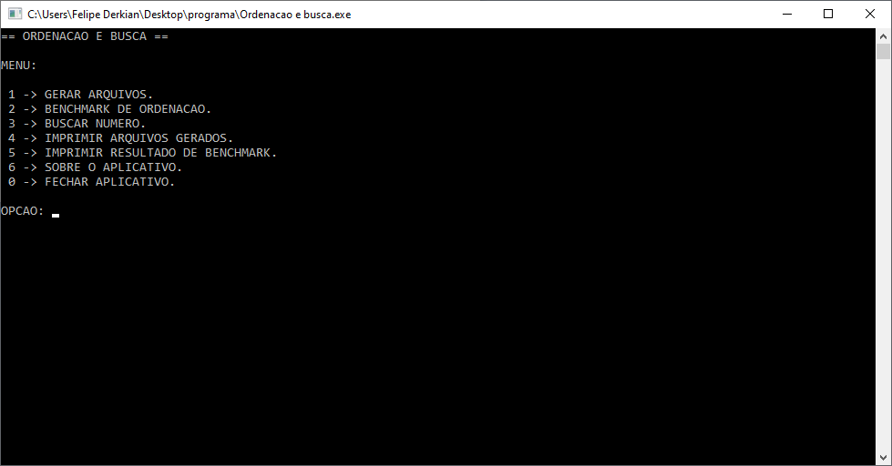
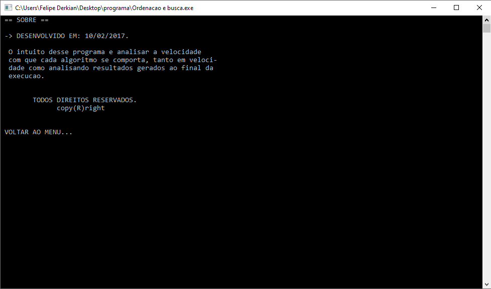
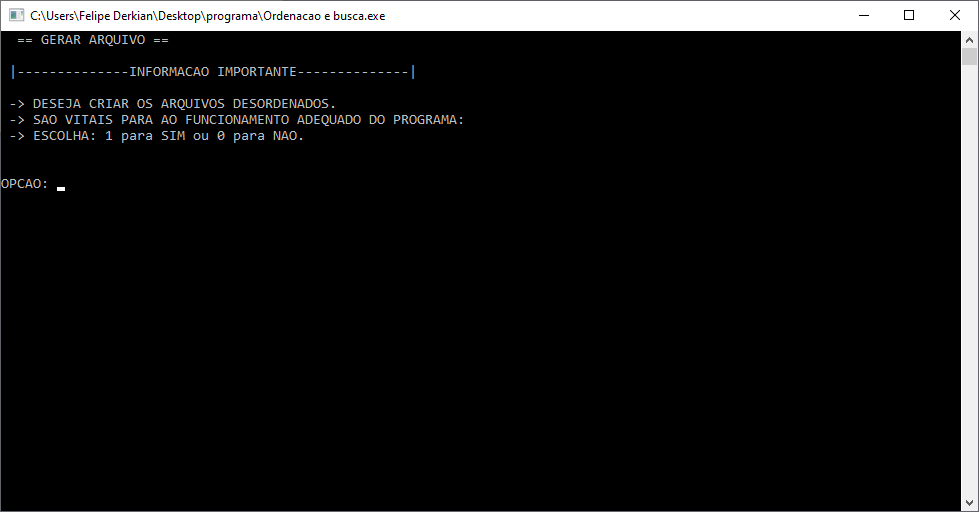
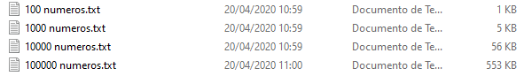
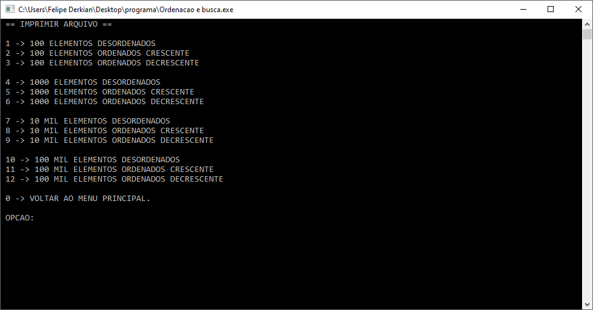
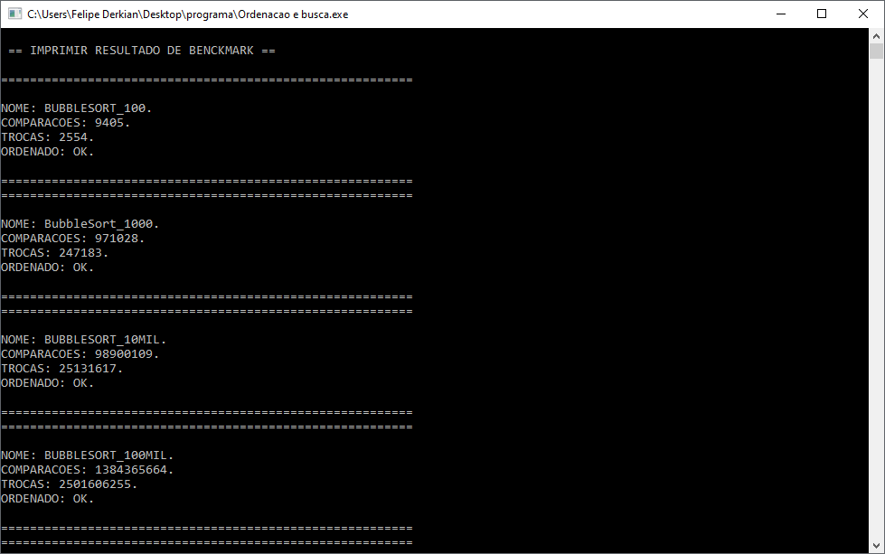
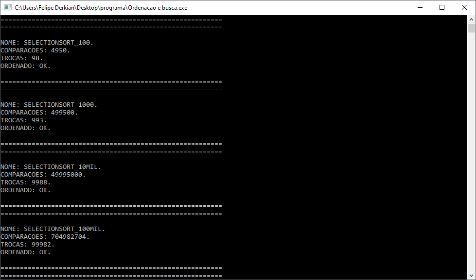
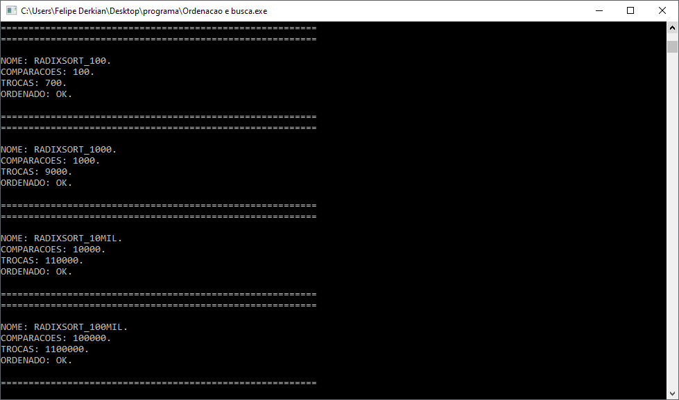

# PROJETO DE ESTRUTURA DE DADOS I ( _ORDENAÇÕES E BUSCAS_ )

Este Trabalho tem por objetivo realizar à <b>implementação em linguagem C</b> dos algoritmos de <b>ordenação e busca</b> mais conhecidos e ao final comparar o desempenho de cada um.

## ORDENAÇÕES UTILIZADAS
1. Bubble Sort
1. Insertion Sort
1. Selection Sort
1. Merge Sort
1. Heap Sort
1. Quick Sort
1. Radix Sort

## BUSCAS
1) Busca Sequencial
2) Busca Binária

## RESULTADOS OBSERVADOS:

Com os algoritmos levados ao extremo com ordenação de vetores com até **100 mil posições** gerando os valores aleatoriamente em arquivo e depois enviados para ordenação observou-se que os algoritmos **O^2** são muito lentos para grandes quantidades de dados enquanto que os com complexidade **nlogn** como Merge Sort são praticamente instantâneos em sua execução.

Já o algoritmo de **Busca Binária** mostrou-se muito mais eficiente visto que no pior caso sua complexidade é **logn** enquanto a busca sequencial no pior caso tem complexidade **n**.

---

# IMAGENS DO PROGRAMA EM FUNCIONAMENTO
  ## Menu

  ## Sobre

  ## Gerar arquivos para análise com _100, 1 mil, 10 mil e 100 mil valores aleatórios_

  ## Arquivos Gerados

  ## Opções de impressão dos arquivos

  ## Resultados _Bubble Sort_

  ## Resultados _Selection Sort_

  ## Resultados _Insertion Sort_

  ## Resultados _Heap Sort_

  ## Resultados _Quick Sort_

  ## Resultados _Merge Sort_

  ## Resultados _Radix Sort_

# OBRIGADO PELA ATENÇÂO.
